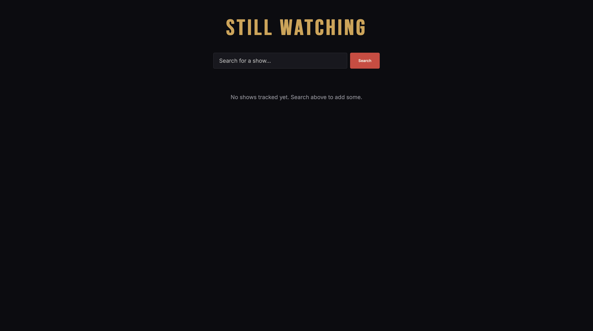
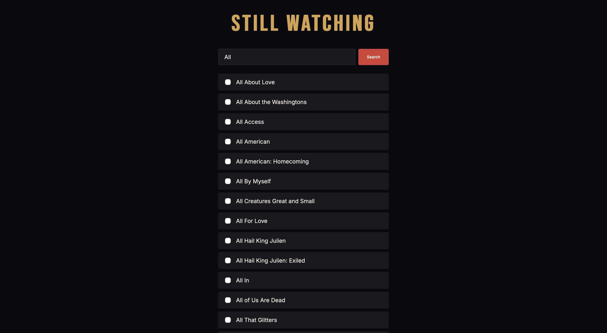
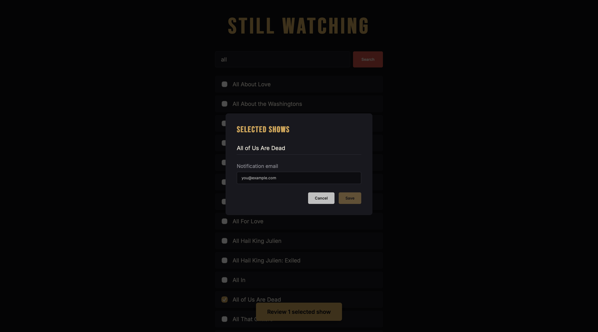
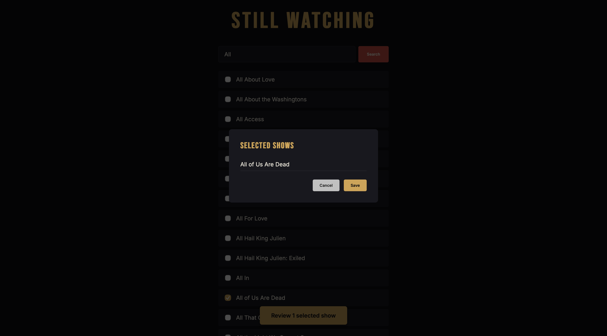
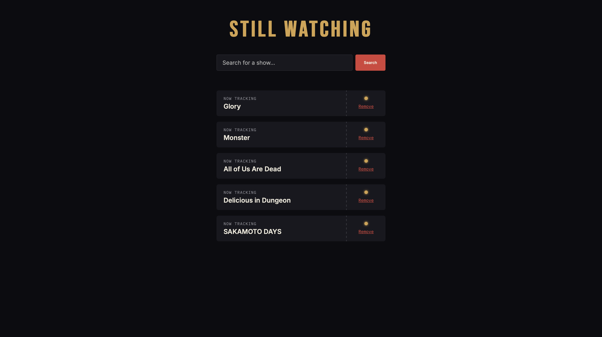

# Still-Watching
Still Watching is a website that notifies you when a Netflix show that you follow has a new episode out. By searching for shows, entering an email, and clicking save, you can stay up-to-date on your favorite shows, saving both time and money.

## How it works
- Search for shows via the uNoGS API
- Select the ones you want to track
- Get emailed automatically when a new season/episode is added
- Runs entirely locally

## Why
As someone who subscribes to Netflix occasionally, I find myself wondering if any of the shows I like have a new season. Since Netflix only gives updates on new episodes while I'm on a subscription, I would either have to search for updates manually or buy a subscription again to find out. This gave me the idea for Still Watching.

## Tech stack

**Backend**
- Python
- FastAPI
- SQLite
- uNoGS API (Netflix catalog data)
- Gmail SMTP (notifications)

**Frontend**
- React
- TypeScript
- Vite

# Demo

*The main home screen when you first open the site.*

*Search for a show based on title. Select the checkbox when you find the show(s) you want.*

*First-time users will be asked to enter their email before being able to save their show(s).*

*Returning users will not be asked for an email since it's saved from their first session.*

*Once saved, you can see your saved shows updated. You can also delete saved shows by clicking the button.*

# How to run

## Setup

### 1. Clone the repo
```bash
git clone https://github.com/Praj-I/Still-Watching
cd Still-Watching
```

### 2. Backend setup
```bash
cd backend
pip install -r requirements.txt
cp .env.example .env
```
Open `.env` and fill in:
- `UNOGS_API_KEY` — your RapidAPI key for [uNoGS](https://rapidapi.com/unogs/api/unogs) API (free tier available)
- `GMAIL_SENDER` — the Gmail address to send notifications from
- `GMAIL_APP_PASSWORD` — the [app password](https://myaccount.google.com/apppasswords) generated for said Gmail account

### 3. Frontend setup
```bash
cd ../still-watching-frontend
npm install
```

## Running the app
You need two terminals running at the same time:

**Terminal 1 — backend:**
```bash
cd backend
uvicorn api:app --reload
```
Runs at `http://127.0.0.1:8000`

**Terminal 2 — frontend:**
```bash
cd still-watching-frontend
npm run dev
```
Runs at `http://localhost:5173`. Open this in your browser.

